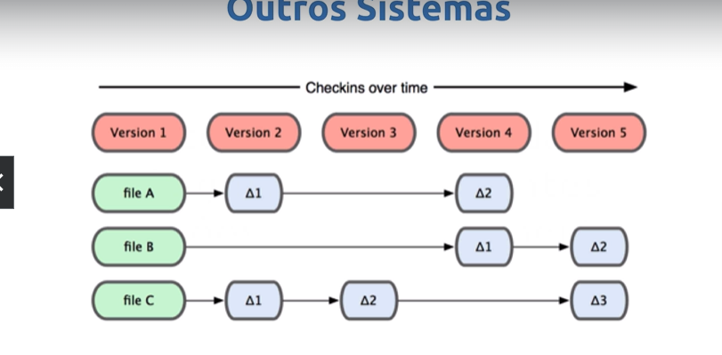
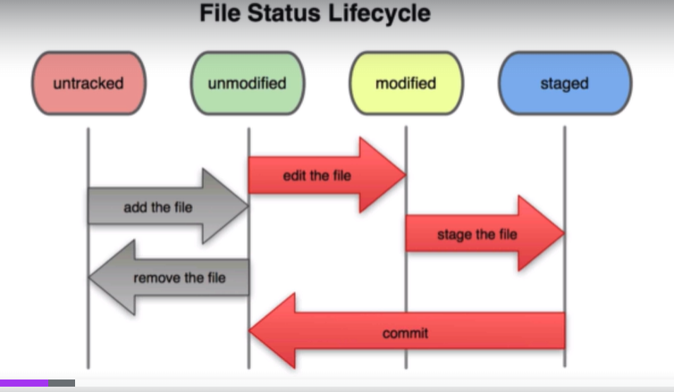

# **Git e Versionamento de Codigo**

# Relatório de Estudos

**Nome do Estagiário:** Rafael Rodrigues
**Data:** 01/08/2024

**Módulos/Etapas Feitas:**  
1. **1/Controle de versão** 

- gerencia vários sistemas de trabalho
 
 - git armazena como snapshot
 - mantém somente uma cópia do arquivo
 - mantém o estado dos arquivos

2. **1/História do Git** 

Desenvolvido por [Linus Torvalds](https://pt.wikipedia.org/wiki/Linus_Torvalds) 

 mesmo criador do linux 🐧.

A empresa linux precisaram usar uma vcs(version control sistem) para a versionar seus códigos. 

escolheram a bitkeeper mas em 2005 a linux brigou feio com eles por terem perdido o direito de isenção e ter que pagar 

então linus torvalds resolveu criar seu próprio vcs.

### Melhorias 
  - Velocidade 
  - Design Simples
  - Suporte robusto a  desenvolvimento não linear (milhares de branches paralelos) 
  - Totalmente distribuído 
  - Capaz de lidar eficientemente com grandes projetos como o kernel do linux

3. **1/O que é o Github ?**

- Serviço de Web compartilhado para projetos que utilizam o Git para versionamento

  - Git é diferente de Github
  - funciona como uma rede social de código

depois de instalar e configurar o git podemos inicializar um repositório.

- com o comando **git init** ele inicia o repositório.
4. **3/O ciclo de vida dos status de seus arquivos**


### Untracked
- Foi criado o repositório mas o git ainda não conhece nenhuma versão desse arquivo.

### Unmodifield
- Ele existe no git mas ainda não tem nenhuma alteração.

### Modifield 
- quando o arquivo é editado, ou seja modificado

### Staged
- usado para colocar as alterações que devem ser adicionadas no próximo commit

5. **3/ Visualizando logs**
Comandos para ver o log:

```
  git log, shortlog, git shortlog sn, git log --graph
```

6. **3/ Visualizando o diff**
- comando que vê as mudanças antes de ser commitado

```
git diff
```
- mostra somente o nome do arquivo que foi modificado

```
git diff --name-only
git commit -am

```

7. **3/ Desfazendo coisas**

 - Ele tira do staged, e volta para modifield

``` 
git reset hard nome-arquivo
``` 

- alterando commit

```
git reset --soft --mixed --hard
```

8. **3/ Criando e Adicionando uma chave SSH**

[GitHub Docs](https://docs.github.com/pt/authentication/connecting-to-github-with-ssh)

Gerar chave ssh

Abra Git Bash.

Cole o texto abaixo, substituindo o email usado no exemplo pelo seu endereço de email GitHub.

```ssh-keygen -t ed25519 -C "your_email@example.com"```

seguencia de comandos do terminal

```
cd ~/.ssh/ 

ls

cat id_ed25519.pub 
```

Copia o nome da chave gerada, para usar no GitHub.

No GitHub vai em:

- configurações -> SSH and GPG Keys -> new SSH Key 

9. **3/ O que é um branch e por que usar?**

- É um ponteiro móvel que leva a um commit

### Vantagens

- Poder modificar sem alterar o local principal (master)
- Facilmente "desligável"
- Múltiplas pessoas trabalhando 
- Evita conflitos

10. **3/ Entendendo o Merge**
- Usado para juntar as mudanças das branchs

### Pro 

- Operação não destrutiva 

### Contra
- Commit extra 
- Histórico poluído


7. **3/ Desfazendo coisas**
7. **3/ Desfazendo coisas**
7. **3/ Desfazendo coisas**
7. **3/ Desfazendo coisas**
7. **3/ Desfazendo coisas**
7. **3/ Desfazendo coisas**
7. **3/ Desfazendo coisas**
7. **3/ Desfazendo coisas**
7. **3/ Desfazendo coisas**


## Assuntos Vistos

- 1. Git 
- ...

## Resumo dos módulos

Nesse primeiro momento de estudos eu entendi que o Git é uma das principais ferramentas para versionamento de código, pois além de rápido ele ajuda a manter o projeto organizado e permite também que mais de uma pessoa possa trabalhar em um mesmo arquivo mantendo as versões atualizadas, além de poder armazenar na nuvem o projeto.


## Links de Laboratórios (se houver)

- [Google Colab 1](URL_do_Lab_1)
- [Google Colab 2](URL_do_Lab_2)
- ...

**Aprendizados dos dias** 

02/08/24

Hoje com o curso de git eu aprendi um pouco mais sobre a criação de um repositório remoto no git hub, como criar uma chave SSH, como posso clonar e a fazer fork. Aprendi também como a criar uma branch com o comando: 
```
git checkout -b nome-branch
```
 ou usando o git flow usando git flow init para inicializa-lo, depois git flow feature start nome-branch.

Se eu quiser listar uma branch eu posso usar o comando:
```
git branch
```

Se eu quiser mudar para minha branch eu uso o comando:

```
git checkout nome-branch OU 
git switch nome-branch
```

Para apagar uma branch eu uso:
```
git branch -D nome-branch ou git branch -d nome-branch
```

E por ultimo aprendi um pouco sobre o merge que é, suas vantagens e desvantagens.


**Recursos Utilizados:**  
- Git
- VSCode
- Terminal
- ...

**Principais comandos: (se aplicável)**  
- [Comando 1]
- [Comando 2]
- [Comando 3]
- ...

**Desafios Encontrados:**  
Ums dos principais desafios foi a questão da organização das branchs e a forma de extruturar o Relatório.

**Feedback e Ajustes:**  
Descreva qualquer feedback que você recebeu e como você ajustou sua abordagem de estudo com base nesse feedback.

**Próximos Passos:**  
Descreva os próximos passos em sua trilha de aprendizagem. Quais são as próximas etapas ou módulos que você irá abordar?


