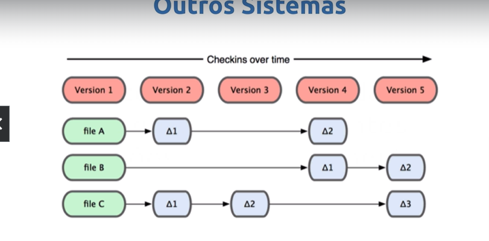
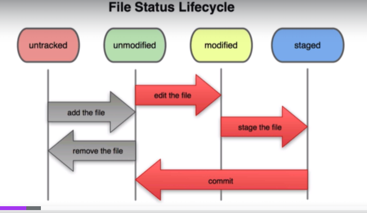

# **Git e Versionamento de Codigo**

# Relatório de Estudos

**Nome do Estagiário:** Rafael Rodrigues
**Data:** 01/08/2024

**Módulos/Etapas Feitas:**  
1. **[1/Controle de versão]:** 

- gerencia vários sistemas de trabalho
 
 - git armazena como snapshot
 - mantém somente uma cópia do arquivo
 - mantém o estado dos arquivos

2. **[1/História do Git]:** 

Desenvolvido por [Linus Torvalds](https://pt.wikipedia.org/wiki/Linus_Torvalds) 

 mesmo criador do linux 🐧.

A empresa linux precisaram usar uma vcs(version control sistem) para a versionar seus códigos. 

escolheram a bitkeeper mas em 2005 a linux brigou feio com eles por terem perdido o direito de isenção e ter que pagar 

então linus torvalds resolveu criar seu próprio vcs.

### Melhorias 
  - Velocidade 
  - Design Simples
  - Suporte robusto a  desenvolvimento não linear (milhares de branches paralelos) 
  - Totalmente distribuído 
  - Capaz de lidar eficientemente com grandes projetos como o kernel do linux

3. **[1/O que é o Github ?]:**

- Serviço de Web compartilhado para projetos que utilizam o Git para versionamento

  - Git é diferente de Github
  - funciona como uma rede social de código

depois de instalar e configurar o git podemos inicializar um repositório.

- com o comando **git init** ele inicia o repositório.
4. **[1/O ciclo de vida dos status de seus arquivos]**

### Untracked
- Foi criado o repositório mas o git ainda não conhece nenhuma versão desse arquivo.

### Unmodifield
- Ele existe no git mas ainda não tem nenhuma alteração.

## Assuntos Vistos

- 1. Git 
- ...

## Resumo dos módulos

Nesse primeiro momento de estudos eu entendi que o Git é uma das principais ferramentas para versionamento de código, pois além de rápido ele ajuda a manter o projeto organizado e permite também que mais de uma pessoa possa trabalhar em um mesmo arquivo mantendo as versões atualizadas, além de poder armazenar na nuvem o projeto.

## Links de Laboratórios (se houver)

- [Google Colab 1](URL_do_Lab_1)
- [Google Colab 2](URL_do_Lab_2)
- ...

**Recursos Utilizados:**  
- Git
- VSCode
- Terminal
- ...

**Principais comandos: (se aplicável)**  
- [Comando 1]
- [Comando 2]
- [Comando 3]
- ...

**Desafios Encontrados:**  
Ums dos principais desafios foi a questão da organização das branchs e a forma de extruturar o Relatório.

**Feedback e Ajustes:**  
Descreva qualquer feedback que você recebeu e como você ajustou sua abordagem de estudo com base nesse feedback.

**Próximos Passos:**  
Descreva os próximos passos em sua trilha de aprendizagem. Quais são as próximas etapas ou módulos que você irá abordar?

