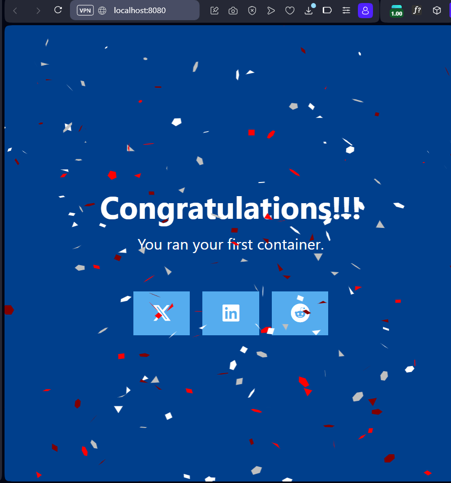
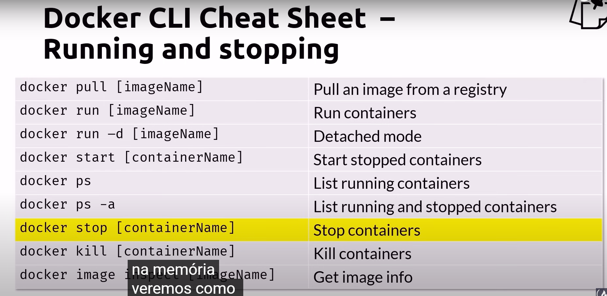
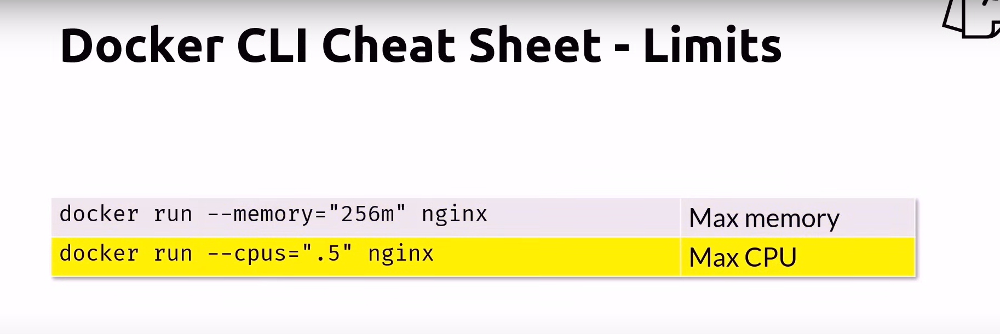
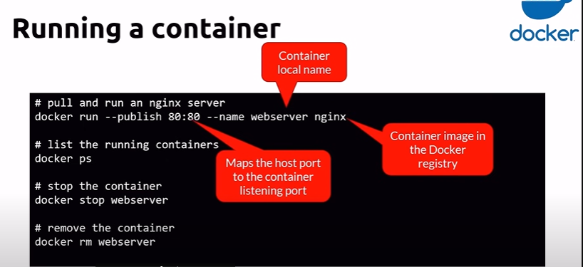
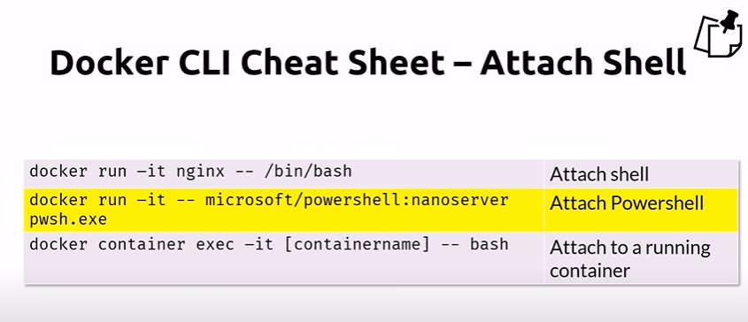
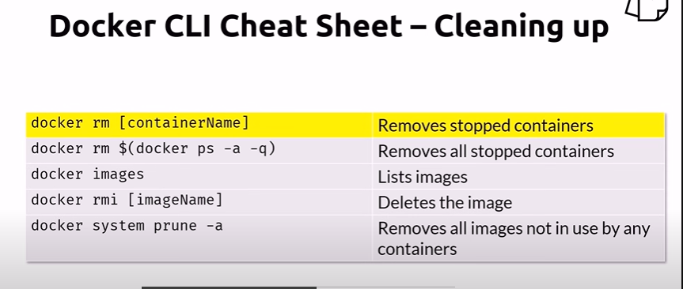

# Relatório de Estudos

**Nome do Estagiário:** Rafael Rodrigues
**Data:** 07/08/24

**Módulos/Etapas Feitas:** 

Referencias: [Docker Containers and Kubernetes Fundamentals – Full Hands-On Course](https://youtu.be/kTp5xUtcalw?si=Bl3Y6OsFM9XE3f8S), [Docker Docs](https://docs.docker.com/guides/docker-concepts/the-basics/what-is-docker-compose/)

1. **01/Visão Geral do Docker**

Plataforma aberta para desenvolver. enviar e executar aplicativos.
Permite separar aplicativos da infraestrutura para que possamos entregar software rapidamente.
com ele podemos gerenciar nossa infraestrutura da mesma forma que gerenciamos nossos aplicativos.

## Plataforma Docker
Nos permite empacotar e executar um aplicativo em um ambiente frouxamente isolado chamado contêiner.
é isolado e seguro permitindo executar muitos contêineres simultaneamente em um determinado host.

## Caracteristicas dos contêineres
- Leves e contêm tudo o que é necessário para executar o aplicativo.
- não depende do que está instalado no host.
- É compartilhado e mantém que todos recebam o mesmo contêiner que funciona da mesma maneira

## Diferença de container e maquina virtual 
- Uma máquina virtual roda em novo Kernel possivelmente uma arquitetura x86 em cima de ARM, já um contêiner reaproveita o mesmo kernel, necessariamente na mesma arquitetura de hardware.


2. **Para que eu posso usar o Docker**
- Entrega rápida e consistente de seu aplicativos
- Simplifica o ciclo de vida do desenvolvimento permitindo que os desenvolvedores trabalhem em ambientes padronizados.
- Contêineres são ótimos para fluxo de trabalho e integração contínua e entrega contínua (CI/CD)
- Quando desenvolvedores encontram bugs, eles podem corrigi-los no ambiente de desenvolvimento e reimplementá-los no ambiente de teste e validação. 
- O Docker é perfeito para ambientes de alta densidade e para implantações pequenas ou médias onde você precisa fazer mais com menos recursos.

## Arquitetura Docker
  

- O docker usa uma arquitetura cliente-servidor. O cliente Docker fala com o daemon Docker, que faz o trabalho pesado de construir, executar e distribuir seus contêineres Docker.

## Daemon Docker

- Escuta solicitações da API Docker e gerencia objetos Docker, como imagens, contêiners, redes e volumes.
- Também se comunica com outros daemons para gerenciar serviços Docker

## Cliente Docker
- Principal maneira pela qual muitos usuários Docker interagem com o Docker.

## Registros do Docker 
- Registro armazena imagens do Docker.
- Docker Hub é um registro público que qualquer pessoa pode usar, e o Docker procurra imagens no Docker Hub por padrão.
- Posso até mesmo executar meu próprio registro privado.

## Objetos do Docker 
 - **Imagens:** modelo somente de leitura com instruções para criar um contêiner do Docker.
 - baseada em outra imagem, com alguma personalização adicional. 

 - **Contêineres:** É uma instância de uma imagem.
 Posso criar, iniciar, parar, mover ou excluir um contêiner usando a API ou CLI do Docker. Posso conectá-lo a mais redes, anexar armazenamento ou até mesmo criar uma nova imagem com o armazenamento atual.
Por padrão um contêiner é bem isolado de outros contêineres.
Um contêiner é definido por sua imagem, quando um contêiner é removido quaisquer alterações que não estejam em seu estado persistente é perdido.

### Exemplo de comando Docker run
- Comando a seguir executa um contêiner ubuntu, anexa interativamente a sua seção de linha de comando local e executa bin/bash.

```
docker run -i -t ubuntu /bin/bash
```
- executando esse comando se eu não tiver a imagem do Ubunto localmente o Docker puxa seu registro configurado, como se você tivesse executado docker pull ubuntu manualmente. 

O docker cira um novo contêiner, como se você tivesse configurado executado um comando docker contêiner manualmente.


3. **2/Começe com o Docker** 
  Neste exemplo vamos aprender um pouco mais do Docker na prática.

  - Comando para iniciar um Contêiner inicial como exemplo.

  ```
  docker run -d -p 8080:80 docker/welcome-to-docker
  ```
  Ele cria um contêiner onde posso ver algumas informações como logs, exec, files, Inspect, etc.

  - clicando no endereço: http://localhost:8080 eu consigo já ver minha página em deploy.
  


## Começando o projeto
 clonei o repositório com o comando:
 ```
 git clone https://github.com/docker/getting-started-todo-app
 ```

 - naveguei até a pasta e executei o comando:
 ```
 cd getting-started-todo-app
 ```
 - Ai com o docker compose eu deixei coloquei meu app para rodar.
```
docker compose watch
```

## O que há no ambiente ?
- Em um alto nível, há vários contêineres (ou processos) que atendem a uma necessidade específica do aplicativo:

Frontend React - Um contêiner node que está executando o servidor de desenvolvimento React, usando Vite

Backend Node - fornece uma API que fornece a capacidade de recuperar, criar e excluir itens de tarefas.

Banco de dados MySQL - banco de dados para armazenar a lista de itens.

phpMyAdmin - Proxy Traefik - com esse ambiente eu não vou me preocupar em instalar ou configurar nenhum serviço, preencher um esquema de banco de dados.

## O que é uma imagem
- Uma imagem, é padronizada e contém todos os arquivos, bináries, configurar arquivos e outras dependências. 
- contém tudo que é necessário para rodar o contêiner
- Uma imagem é imutável
- pode ser adicionado camadas nelas
- Evita o famoso ditado "funcionou na minha máquina"

## O que é um registro ?
- podemos enviar ou extrair imagens
- exemplo de registros github Contêiner registro, docker hubs, amazon ECR, etc.
- docker hub disponibiliza um padrão 
- mantém todos com a mesma configurações nas suas máquinas.

## O que é o Docker Compose ?
- Facilita aos desenvolvedores definir e executar aplicativos Docker com vários contêineres.
- sem o docker compose eu preciso executar vários comandos para configurar meu app.
- quando digito ```docker compose up -d --build```
ele gera uma arquivo YAML. Onde posso descrever quais imagens usar ou criar, e como esses contêineres podem se comunicar entre si.
- quando terminar só digitar ```docker compose down```

4. ...

## Resumo dos módulos 

07/08/24

No dia de Hoje eu iniciei os estudos de Docker, entendi um pouco sobre os contâiners o que o Docker oferece de bom comparado a outras formas de deploy de aplicações por ser rápido e leve.
Com o Docker podemos fazer entregas contínuas de softwares, ele é seguro e isolado permitindo executar vários côntainers simultaneamente em um determinado host.

Hoje dia 08/09/2024 aprendi um pouco mais sobre os contêineres, as imagens do docker e pratiquei um pouco.

## Comandos Docker
- docker info
- docker version
- docker login











## Links de Laboratórios (se houver)

- [Google Colab 1/Notion 1](URL_do_Lab_1)
- [Google Colab 2/Notion 2](URL_do_Lab_2)
- ...

**Recursos Utilizados:**  
- VS Code 
- [Recurso 2]
- [Recurso 3]
- ...

**Desafios Encontrados:**  
Problemas com a falta de internet.

**Feedback e Ajustes:**  
Gostei do conteúdo da trilha.

**Próximos Passos:**  
Vou continuar meus estudos em Docker.
